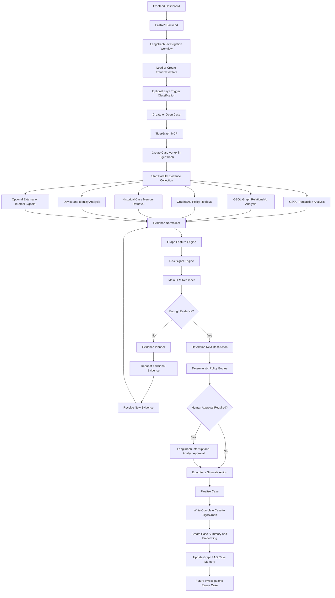

# TigerGraph Agentic Fraud Investigation — Project Description

## 1. Project Name

**TigerGraph Agentic Fraud Investigation Agent — HHGOA**

## 2. Project Goal

Build an agentic fraud investigation system that can move from an uncertain fraud signal to a defensible next-best action using graph evidence, transaction behavior, device and identity relationships, historical cases, fraud policies, controlled evidence gathering, and human approval.

The system must:

- Investigate fraud alerts, customer reports, analyst requests, and technical alerts.
- Use TigerGraph as the core graph and case-memory platform.
- Use GSQL for fraud graph analytics and relationship analysis.
- Use TigerGraph MCP as the agent-facing graph tool layer.
- Use GraphRAG to retrieve fraud policies, typologies, regulatory guidance, and relevant historical cases.
- Track uncertainty explicitly.
- Request additional evidence when necessary.
- Recommend or simulate next-best actions.
- Enforce action permissions through a deterministic policy engine.
- Require human approval for sensitive actions.
- Persist the complete investigation back to TigerGraph.
- Reuse resolved cases as memory for future investigations.
- Produce benchmark answer files for all 20 provided benchmark cases.

---

# 3. Final Technology Choices

These choices are fixed for the project.

## 3.1 Frontend

**Framework:** Next.js  
**Language:** TypeScript  
**UI:** React + Tailwind CSS + shadcn/ui  
**Graph Visualization:** Cytoscape.js  
**Charts:** Recharts  
**Realtime Investigation Updates:** Server-Sent Events (SSE)

Why:

- Next.js provides a fast production-ready frontend.
- Cytoscape.js is well suited to interactive fraud-network visualization.
- SSE is simpler than WebSockets for streaming investigation progress from backend to frontend.

---

## 3.2 Backend

**Framework:** FastAPI  
**Language:** Python 3.11+  
**Data Validation:** Pydantic v2  
**Concurrency:** Python asyncio

Responsibilities:

- Receive frontend requests.
- Validate inputs.
- Authenticate analyst requests.
- Start or resume LangGraph workflows.
- Stream investigation events using SSE.
- Expose case, evidence, action, approval, and benchmark APIs.
- Execute or simulate permitted actions.

---

## 3.3 Agent Orchestration

**Framework:** LangGraph

LangGraph controls the complete investigation state machine.

The LLM does not control the entire application.

LangGraph determines:

- which investigation stage runs next,
- which tools are allowed,
- when evidence is sufficient,
- when human approval is required,
- when to request additional evidence,
- when to stop the investigation,
- how to resume paused investigations.

Sensitive actions use LangGraph interrupts.

---

## 3.4 Graph Platform

**Platform:** TigerGraph Savanna

TigerGraph is the central investigation and memory platform.

TigerGraph stores:

- customers,
- accounts,
- cards,
- transactions,
- devices,
- IPs,
- identity attributes,
- merchants,
- fraud cases,
- evidence,
- decisions,
- actions,
- approvals,
- fraud patterns,
- policy references,
- case outcomes,
- embeddings for GraphRAG and case-memory search.

TigerGraph is not used only as storage. It performs core fraud investigation logic.

---

## 3.5 Graph Query and Analytics

**Language:** GSQL

Installed GSQL queries are used for repeated fraud-analysis tasks.

Core query set:

- `get_transaction_context`
- `get_transaction_behavior`
- `get_entity_neighborhood`
- `find_shared_devices`
- `find_shared_ips`
- `find_fraud_neighbors`
- `get_shortest_path_to_fraud`
- `detect_money_flow_patterns`
- `detect_fan_in`
- `detect_fan_out`
- `detect_cycles`
- `get_connected_cluster`
- `get_device_identity_context`
- `find_similar_graph_cases`
- `get_case_timeline`
- `write_case_update`

Graph algorithms are used only when they provide fraud-investigation value.

Required algorithm categories:

- connected components,
- community detection,
- shortest paths,
- cycle detection,
- neighbor similarity,
- graph centrality where useful.

---

## 3.6 Agent-to-Graph Tool Layer

**Tool Layer:** TigerGraph MCP

TigerGraph MCP exposes graph capabilities to the investigation agent.

Runtime MCP access is restricted.

Allowed:

- graph reads,
- installed investigation queries,
- vector search,
- bounded graph traversal,
- safe case updates.

Not allowed:

- destructive schema operations,
- graph deletion,
- unrestricted destructive writes.

---

## 3.7 GraphRAG

**Framework:** TigerGraph GraphRAG

GraphRAG is used for hybrid retrieval.

It retrieves:

- fraud policies,
- fraud typologies,
- regulatory guidance,
- historical case summaries,
- relevant prior analyst decisions.

GraphRAG combines:

- vector similarity,
- graph relationships.

Whole documents are not passed to the LLM.

Only relevant policy and historical evidence is retrieved.

---

## 3.8 Primary LLM

**Provider:** Groq  
**Primary Reasoning Model:** `openai/gpt-oss-120b`  
**Fast Reasoning Model:** `openai/gpt-oss-20b`

Use `gpt-oss-120b` for:

- fraud hypotheses,
- evidence synthesis,
- uncertainty assessment,
- next-best action selection,
- final explanation,
- conflicting-evidence reasoning.

Use `gpt-oss-20b` for:

- lightweight summarization,
- simple extraction,
- low-cost structured reasoning tasks.

---

## 3.9 LLM Fallback

**Provider:** Google Gemini  
**Fallback Model:** Gemini Flash

Gemini is used only when:

- Groq is unavailable,
- Groq rate limit is reached,
- unusually large context must be processed.

---

## 3.10 Fast Local Classification

**Model:** ConvAI Innovations Laya

Laya is optional but included as a fast local classifier.

Laya is used only for:

- trigger classification,
- customer-response classification,
- analyst-response classification,
- simple routing.

Laya does not make the final fraud decision.

Laya does not vote over individual evidence items.

Laya does not independently determine whether evidence is sufficient.

---

## 3.11 Historical Risk Model

**Library:** LightGBM

LightGBM is trained only on legitimate historical closed-case information available for training.

Inputs may include:

- bank risk score,
- graph fraud-neighbor count,
- transaction velocity,
- shared-device count,
- shared-IP count,
- distance to fraud network,
- amount anomaly,
- new-device indicator,
- community size,
- money-flow features.

The LightGBM score is an additional signal only.

It never replaces graph analysis or policy-controlled reasoning.

---

## 3.12 Data Processing

**Libraries:**

- Polars
- DuckDB

These are used for:

- dataset inspection,
- CSV processing,
- feature generation,
- preprocessing,
- benchmark preparation,
- TigerGraph loading preparation.

---

## 3.13 Embeddings

**Library:** SentenceTransformers

Embeddings are generated locally.

Embeddings are created for:

- fraud policy sections,
- fraud typologies,
- regulatory references,
- historical case summaries,
- analyst-decision summaries.

Transactions are not blindly embedded.

Transaction investigation is graph-first.

---

## 3.14 Hosting

**Backend Hosting:** AWS EC2  
**Artifact Storage:** AWS S3  
**Logs:** AWS CloudWatch

AWS credits are reserved for reliable hosting and storage instead of primary LLM inference.

TigerGraph remains on Savanna.

EC2 hosts:

- FastAPI,
- LangGraph,
- TigerGraph MCP client,
- model router,
- benchmark runner.

S3 stores:

- benchmark answer files,
- SAR outputs,
- exported case JSON,
- demo artifacts,
- audit exports.

---

## 3.15 Observability

**Platform:** Langfuse

Langfuse records:

- LLM calls,
- tool calls,
- latency,
- token use,
- errors,
- investigation traces.

---

# 4. High-Level System Architecture



---

# 5. Complete Runtime Flow

## Step 1 — Frontend Request

Possible triggers:

- fraud risk alert,
- customer report,
- analyst investigation request,
- device alert,
- transaction alert.

Example request:

```json
{
  "trigger_type": "ANALYST_REQUEST",
  "transaction_id": "T123"
}
```

---

## Step 2 — FastAPI Validation

FastAPI validates:

- request format,
- transaction/account/customer identifiers,
- analyst authorization,
- whether an existing case should be resumed.

If valid, it starts the LangGraph workflow.

---

## Step 3 — Load Investigation State

LangGraph creates or restores `FraudCaseState`.

Main fields:

```text
case_id
trigger_type
transaction_id
customer_id
account_ids
bank_risk_score

graph_evidence
transaction_evidence
device_evidence
identity_evidence
policy_evidence
historical_case_evidence
external_evidence

graph_features

fraud_hypotheses

risk
confidence
evidence_completeness

missing_evidence

pre_evidence_next_best_action
requested_evidence
received_evidence
post_evidence_next_best_action

approval_required
approval_status

executed_actions

sar_required
case_status
stop_reason
```

---

# 6. Parallel Evidence Collection

All independent investigation branches run concurrently.

## 6.1 GSQL Transaction Analysis

Purpose:

Understand current and historical transaction behavior.

Collect:

- current amount,
- historical average,
- historical median,
- transaction count in recent windows,
- transaction velocity,
- unusual merchant,
- unusual amount,
- recent failed/successful attempts,
- transaction timing anomalies.

Example features:

```text
amount_ratio = 14.8x normal median
transactions_last_10_minutes = 6
new_merchant = true
velocity_anomaly = true
```

---

## 6.2 GSQL Graph Relationship Analysis

Purpose:

Discover suspicious structural relationships.

Analyze:

- account-to-account relationships,
- customer-to-device relationships,
- shared devices,
- shared IPs,
- identity links,
- merchant relationships,
- graph distance to prior confirmed fraud,
- connected components,
- communities,
- circular transfer paths,
- fan-in,
- fan-out,
- fraud-linked neighbors.

Example:

```text
Device D17 is used by 8 accounts.
3 of those accounts appeared in confirmed fraud cases.
Current account is one hop away from a known fraud entity.
```

---

## 6.3 GraphRAG Policy Retrieval

Purpose:

Retrieve only the policies and typologies relevant to the current investigation.

Retrieve:

- applicable fraud policy,
- fraud typology,
- regulatory guidance,
- action restrictions,
- approval requirements,
- SAR/report conditions.

This output later controls the explanation and policy engine.

---

## 6.4 Historical Case Memory Retrieval

Purpose:

Find prior investigations similar to the current case.

Use both:

- graph similarity,
- vector similarity.

Retrieve:

- top similar cases,
- shared entities,
- prior outcome,
- prior fraud pattern,
- prior analyst action,
- prior approval path,
- previous evidence requests.

Both confirmed-fraud and cleared cases must be considered.

---

## 6.5 Device and Identity Analysis

Purpose:

Analyze device and identity behavior more deeply than general graph traversal.

Check:

- whether device is new for the customer,
- device age,
- number of accounts using device,
- prior fraud cases involving device,
- shared IPs,
- shared emails,
- shared phones,
- shared addresses,
- unusual identity relationships.

---

## 6.6 Optional External or Internal Signals

Purpose:

Enrich investigation when useful.

Possible simulated sources:

- authentication system,
- customer CRM,
- device reputation,
- IP reputation,
- merchant risk,
- previous step-up authentication,
- card status,
- login history.

This branch is optional and is not required for the first working version.

---

# 7. Evidence Normalization

Every source is converted to a common evidence structure.

Example:

```json
{
  "evidence_id": "E019",
  "source": "TIGERGRAPH_GSQL",
  "category": "DEVICE",
  "fact": "Device D91 is shared by 11 accounts.",
  "reliability": "HIGH",
  "supports": [
    "ACCOUNT_TAKEOVER",
    "COORDINATED_FRAUD"
  ],
  "contradicts": [],
  "entity_ids": [
    "D91"
  ]
}
```

Policy evidence example:

```json
{
  "evidence_id": "P004",
  "source": "POLICY_GRAPHRAG",
  "category": "POLICY",
  "fact": "Step-up authentication is required before account blocking when customer involvement remains uncertain.",
  "reliability": "AUTHORITATIVE",
  "policy_id": "POL-17"
}
```

---

# 8. Graph Feature Engine

The graph feature engine calculates deterministic fraud features.

Required features include:

- shared device count,
- shared IP count,
- fraud-neighbor count,
- transaction velocity,
- amount deviation,
- new device indicator,
- new IP indicator,
- fraud-network distance,
- connected-component size,
- fan-in count,
- fan-out count,
- suspicious cycle indicator,
- money-flow pattern features.

These features are passed to the risk engine.

---

# 9. Risk Signal Engine

The risk signal engine combines:

1. bank risk score,
2. graph-derived features,
3. deterministic fraud rules,
4. known fraud-pattern matches,
5. optional LightGBM historical-risk signal.

The system does not rely on one score alone.

---

# 10. Main LLM Reasoning

The main reasoning model receives compact evidence rather than raw data dumps.

The model produces structured output containing:

- likely fraud hypotheses,
- supporting evidence,
- contradictory evidence,
- risk level,
- confidence,
- evidence completeness,
- missing evidence,
- preliminary next-best action.

The model must reference evidence IDs.

The model does not expose hidden chain-of-thought.

It provides only concise auditable rationale.

---

# 11. Risk, Confidence, and Evidence Completeness

These are separate variables.

## Risk

How suspicious or harmful the activity appears.

Example:

```text
LOW
MEDIUM
HIGH
CRITICAL
```

## Confidence

How certain the system is about the assessment.

Example:

```text
0.0 to 1.0
```

## Evidence Completeness

Whether enough information exists to take a defensible action.

Example:

```text
0.0 to 1.0
```

Example situation:

```text
Risk = HIGH
Confidence = LOW
Evidence Completeness = LOW
```

Result:

```text
REQUEST MORE EVIDENCE
```

Example:

```text
Risk = HIGH
Confidence = HIGH
Evidence Completeness = HIGH
```

Result:

```text
PROCEED TO NEXT BEST ACTION
```

---

# 12. Evidence Sufficiency Gate

LangGraph checks whether the investigation contains enough evidence to act.

If evidence is sufficient:

```text
Determine Next Best Action
```

If evidence is insufficient:

```text
Record current next-best action
→ Determine highest-value missing evidence
→ Request evidence
→ Receive evidence
→ Add evidence
→ Recalculate
→ Reassess
```

---

# 13. Additional Evidence Planner

The system requests the smallest useful piece of evidence.

Possible evidence requests:

- customer transaction confirmation,
- step-up authentication,
- analyst-provided information,
- approved external verification.

The planner uses a value-of-information concept:

```text
expected uncertainty reduction
× expected decision impact
÷ cost, friction, and latency
```

The recommendation before requesting evidence must be recorded.

The recommendation after receiving evidence must also be recorded.

---

# 14. Next-Best Actions

Supported action categories:

```text
ALLOW_TRANSACTION
BLOCK_TRANSACTION
MONITOR_TRANSACTION
MONITOR_ACCOUNT
BLOCK_ACCOUNT
WARN_CUSTOMER
REQUEST_CUSTOMER_CONFIRMATION
REQUEST_STEP_UP_AUTH
REQUEST_ANALYST_EVIDENCE
ESCALATE_ANALYST
FILE_SAR
CLOSE_CASE
NO_ACTION
```

The exact final action set must match the dataset policy.

---

# 15. Deterministic Policy Engine

The policy engine is code-driven.

The LLM recommends actions.

The policy engine decides whether an action is permitted.

Checks include:

- is the action allowed?
- can the AI execute it?
- is human approval required?
- which role must approve?
- is SAR/report generation required?

Implementation:

```text
policy.yaml
+
Python rule engine
```

Open Policy Agent is not included.

---

# 16. Human Approval

Sensitive actions are paused using LangGraph interrupts.

Frontend shows:

```text
Recommended Action
Risk
Confidence
Evidence
Policy Basis
Required Approver
```

Analyst choices:

```text
APPROVE
REJECT
MODIFY
```

The analyst decision and reason are written back to the case.

---

# 17. Action Execution

Real integrations are not required.

Actions may be simulated.

Possible mock actions:

- block transaction,
- monitor account,
- freeze account,
- warn customer,
- request authentication,
- escalate case,
- generate SAR,
- update CRM.

Every action is recorded.

---

# 18. Stop Conditions

Investigation stops when one of these is true:

```text
SUFFICIENT_EVIDENCE_FOR_ACTION
POLICY_MANDATED_ESCALATION
LOW_VALUE_OF_ADDITIONAL_EVIDENCE
AWAITING_HUMAN_REVIEW
NO_MATERIAL_FRAUD_EVIDENCE
```

`stop_reason` is always written into the final case.

---

# 19. Case Memory

The completed investigation is written back to TigerGraph.

Case memory includes:

- trigger,
- entities investigated,
- transactions,
- evidence,
- graph findings,
- fraud patterns,
- hypotheses,
- risk assessments,
- uncertainty,
- additional evidence requests,
- customer responses,
- analyst responses,
- actions,
- approvals,
- SAR status,
- final outcome,
- stop reason.

Example relationships:

```text
Case
├── INVESTIGATED → Account
├── INVESTIGATED → Device
├── INVOLVED → Transaction
├── MATCHED → FraudPattern
├── USED_EVIDENCE → Evidence
├── RECOMMENDED → Action
├── APPROVED_BY → Analyst
└── OUTCOME → CaseOutcome
```

---

# 20. Case Memory Retrieval

Future investigations use two forms of memory retrieval.

## Graph Similarity

Look for:

- same device,
- same IP,
- same merchant,
- same accounts,
- same identities,
- same fraud network,
- similar graph topology.

## Vector Similarity

Compare:

- case summaries,
- investigation findings,
- analyst decisions,
- fraud typology descriptions.

The system retrieves the top relevant historical cases.

Prior cases are treated as precedent, not proof.

---

# 21. Core Case Flows

The same LangGraph workflow handles all benchmark cases.

No benchmark case is hardcoded.

## Case A — High Risk, Enough Evidence

```text
Trigger
→ Graph investigation
→ Strong fraud relationships
→ Policy retrieval
→ Similar fraud cases
→ High risk
→ High confidence
→ Evidence complete
→ Next best action
→ Policy check
→ Human approval if required
→ Execute
→ Store case
```

---

## Case B — High Risk, Uncertain Evidence

```text
Trigger
→ High bank risk
→ Weak graph evidence
→ Mixed historical evidence
→ High risk
→ Low confidence
→ Low evidence completeness
→ Record pre-evidence NBA
→ Request customer validation
→ Receive customer response
→ Reassess
→ Updated NBA
→ Policy check
→ Action
→ Store case
```

---

## Case C — Customer Reports Fraud

```text
Customer report
→ Laya trigger classification
→ Case creation
→ Transaction and graph investigation
→ Device and identity analysis
→ Policy retrieval
→ Risk assessment
→ Next best action
→ Approval if required
→ Action
→ Store case
```

---

## Case D — Analyst Manual Investigation

```text
Analyst selects account/customer
→ Create case
→ Expand graph neighborhood
→ Run graph algorithms
→ Retrieve historical cases
→ Retrieve policies
→ Build evidence
→ Assess case
→ Next best action
→ Store result
```

---

## Case E — Legitimate / Cleared Activity

```text
Trigger
→ Known device
→ Normal transaction pattern
→ No fraud-network links
→ Similar cleared cases
→ Low risk
→ High confidence
→ Evidence complete
→ Allow or no action
→ Close case
→ Save cleared case as memory
```

---

## Case F — Fraud Ring

```text
Trigger
→ Graph traversal
→ Shared device/IP
→ Connected fraud accounts
→ Money-flow analysis
→ Community detection
→ Prior fraud cases
→ Critical risk
→ High confidence
→ Escalate/block/report
→ Approval
→ Store fraud network and case
```

---

## Case G — Unknown Fraud Pattern

```text
Trigger
→ Unusual graph structure
→ No known typology exact match
→ Similar historical structures
→ Medium/high risk
→ Medium confidence
→ Request additional evidence
→ Reassess
→ Action
→ Store new pattern observations
```

---

## Case H — Step-Up Authentication

```text
Investigation
→ High risk but medium confidence
→ Record pre-evidence NBA
→ Request step-up authentication

PASS
→ Risk decreases
→ Allow or monitor

FAIL
→ Risk increases
→ Block/escalate

→ Record updated NBA
→ Store case
```

---

## Case I — Human Approval Required

```text
Recommendation
→ Policy engine
→ Approval required
→ LangGraph interrupt
→ Analyst approves/rejects/modifies
→ Record analyst decision
→ Execute or reassess
→ Store case
```

---

## Case J — SAR Required

```text
Investigation
→ Fraud assessment
→ Policy engine
→ SAR required
→ Generate report from verified evidence
→ Compliance approval if required
→ Store report reference
→ Close/update case
```

---

# 22. Frontend Screens

## 22.1 Case Queue

Shows:

- case ID,
- trigger,
- risk,
- confidence,
- status,
- created time.

## 22.2 Investigation View

Shows:

- current case state,
- timeline,
- live investigation updates.

## 22.3 Fraud Graph

Cytoscape.js shows:

- customer,
- accounts,
- transactions,
- devices,
- IPs,
- merchants,
- linked fraud cases,
- suspicious paths.

## 22.4 Evidence Panel

Shows:

- evidence ID,
- source,
- category,
- fact,
- reliability,
- supporting/contradicting status.

## 22.5 Assessment Panel

Shows:

- risk,
- confidence,
- evidence completeness,
- fraud hypotheses,
- known fraud-pattern match.

## 22.6 Similar Cases Panel

Shows:

- case ID,
- similarity,
- shared entities,
- historical outcome,
- analyst action.

## 22.7 Next Best Action Panel

Shows:

- recommendation before additional evidence,
- recommendation after additional evidence,
- policy basis,
- approval route.

## 22.8 Approval Panel

Buttons:

```text
APPROVE
REJECT
MODIFY
```

---

# 23. Backend API Structure

Core API routes:

```text
POST /api/investigations
GET  /api/investigations/{case_id}
GET  /api/investigations/{case_id}/events
GET  /api/investigations/{case_id}/graph
GET  /api/investigations/{case_id}/evidence

POST /api/investigations/{case_id}/evidence
POST /api/investigations/{case_id}/approve
POST /api/investigations/{case_id}/reject
POST /api/investigations/{case_id}/modify-action

POST /api/mock/customer-confirmation
POST /api/mock/step-up-auth

GET /api/cases
GET /api/cases/{case_id}

POST /api/benchmark/run
```

---

# 24. Repository Structure

```text
project-root/

frontend/
  app/
  components/
  lib/
  services/
  types/

backend/
  app/
    api/
    agents/
    graph/
    rag/
    policies/
    services/
    models/
    schemas/
    ml/
    memory/
    actions/
    observability/

gsql/
  schema/
  loading/
  queries/
  algorithms/

data/
  raw/
  processed/
  policies/
  benchmark/

models/
  lightgbm/
  embeddings/

scripts/
  load_tigergraph.py
  preprocess_data.py
  build_embeddings.py
  train_lightgbm.py
  run_benchmark.py

outputs/
  benchmark/
  sar/
  cases/

tests/
  unit/
  integration/
  benchmark/

docs/
  architecture.md
  demo.md
  blog-notes.md

project_description.md
README.md
```

---

# 25. Benchmark Execution

A single benchmark runner executes all 20 benchmark cases.

Command:

```bash
python scripts/run_benchmark.py
```

For each case it must:

1. create/open the fraud case,
2. run the normal LangGraph workflow,
3. gather graph evidence,
4. retrieve policy and case memory,
5. assess risk and uncertainty,
6. record the NBA before additional evidence,
7. request evidence when necessary,
8. process received evidence,
9. record updated NBA,
10. perform policy checks,
11. record approval requirements,
12. generate SAR when required,
13. write complete case to TigerGraph,
14. export answer file.

No benchmark answer may be hardcoded.

No hidden benchmark outcome may be used as an input.

---

# 26. Output Requirements Per Benchmark Case

Each benchmark answer file contains:

- case details,
- trigger,
- internal investigation record,
- evidence,
- graph findings,
- fraud hypotheses,
- matched typologies,
- policy evidence,
- similar historical cases,
- risk,
- confidence,
- evidence completeness,
- missing evidence,
- next-best action before additional evidence,
- requested evidence,
- received evidence,
- next-best action after additional evidence,
- approval route,
- actions,
- SAR/report when required,
- final case status,
- stop reason.

---

# 27. Implementation Priority

Implementation order is fixed.

## Phase 1 — Core End-to-End Investigation

Build:

```text
Frontend
→ FastAPI
→ LangGraph
→ TigerGraph
→ GSQL
→ Evidence
→ Groq
→ Next Best Action
→ Store Case
```

One case must work completely before adding advanced features.

## Phase 2 — Uncertainty and Evidence Requests

Add:

- risk/confidence/completeness,
- evidence sufficiency gate,
- customer confirmation,
- step-up authentication,
- before/after next-best action.

## Phase 3 — Memory and Policy

Add:

- GraphRAG policy retrieval,
- case memory,
- similar-case search,
- policy engine,
- human approvals.

## Phase 4 — Enhancements

Add:

- LightGBM,
- Laya,
- Langfuse,
- external/mock signals,
- advanced graph algorithms.

## Phase 5 — Benchmark and Demo

Run all benchmark cases.

Fix:

- incorrect graph retrieval,
- incorrect actions,
- missing evidence,
- policy violations,
- output-format errors.

---

# 28. Features That Are Explicitly Not Included

To avoid unnecessary complexity, the following are excluded:

- CrewAI,
- Hermes as a second agent framework,
- Pinecone,
- Qdrant,
- Weaviate,
- Chroma,
- Neo4j,
- OpenSearch as a separate retrieval layer,
- Open Policy Agent,
- SageMaker pipelines,
- multiple orchestration frameworks.

The stack remains intentionally focused.

---

# 29. Core Design Principle

The project follows this responsibility model:

```text
TigerGraph
= facts, relationships, graph intelligence, memory

GSQL
= deterministic fraud graph analytics

GraphRAG
= policy, typology, regulatory, and case retrieval

LightGBM
= historical learned risk signal

Laya
= fast lightweight classification

Groq GPT-OSS
= evidence reasoning and synthesis

LangGraph
= investigation workflow and state

Policy Engine
= permissions and approval rules

FastAPI
= application backend

Next.js
= analyst experience

AWS
= reliable hosting and artifact storage
```

No single model decides fraud by itself.

Every important action must be supported by evidence and policy.

---

# 30. Success Definition

The project is successful when it can demonstrate:

1. A fraud case starts from any supported trigger.
2. TigerGraph retrieves connected entities and suspicious relationships.
3. GSQL calculates fraud-specific graph features.
4. GraphRAG retrieves relevant policies and prior cases.
5. Evidence is normalized into auditable evidence objects.
6. The agent distinguishes risk, confidence, and evidence completeness.
7. The agent requests more evidence when necessary.
8. The recommendation changes correctly after new evidence arrives.
9. Sensitive actions pass through a deterministic policy and approval layer.
10. The investigation stops for an explicit reason.
11. The full case is stored in TigerGraph.
12. A future case can retrieve the completed case as memory.
13. All 20 benchmark cases run through the same investigation workflow.
14. The UI clearly shows the graph, evidence, uncertainty, actions, approvals, and timeline.
